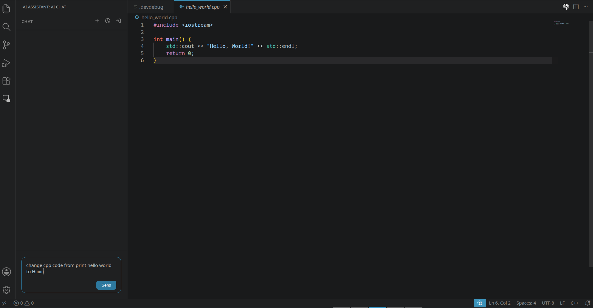
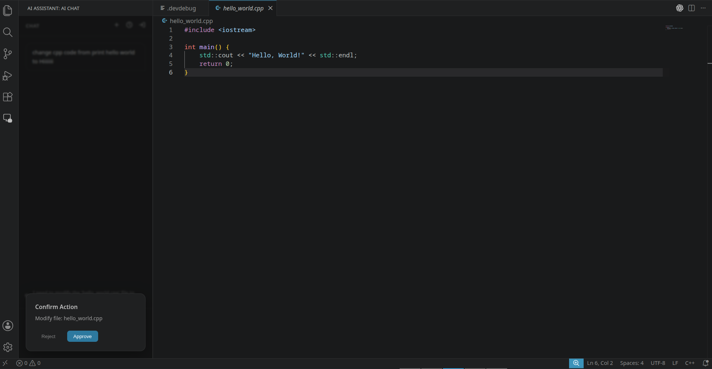
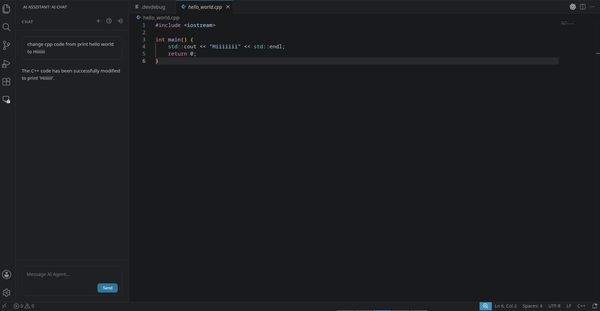

# Demo: RNet SSO + Agent

**AI Assistant** is an autonomous coding agent demonstrating secure, frictionless AI token sharing via the **RNet SSO** ecosystem.

## Benefits of RNet SSO

RNet SSO provides a "Log in with AI" experience:
- **Zero Friction:** Users log in once and share AI tokens across Web, CLI, and IDEs. No manual API key pasting.
- **Developer Simplicity:** Focus on agent logic. RNet handles the backend AI provider proxying, usage limits, and billing.

## Features
- **Autonomous Agent:** Refactors code, fixes bugs, and runs commands automatically.
- **Persistent Sessions:** History is saved locally and survives restarts.
- **RNet SSO Auth:** Secure, one-click authentication.

## Installation
1. Install the `.vsix` file.
2. Click the **AI Assistant** icon in the Activity Bar.
3. Click **Login with RNet**.

## Screenshots

### 1. Sidebar Chat Interface

### 2. Autonomous Action Confirmation

### 3. Action Success

## License
MIT License. See [LICENSE](LICENSE).